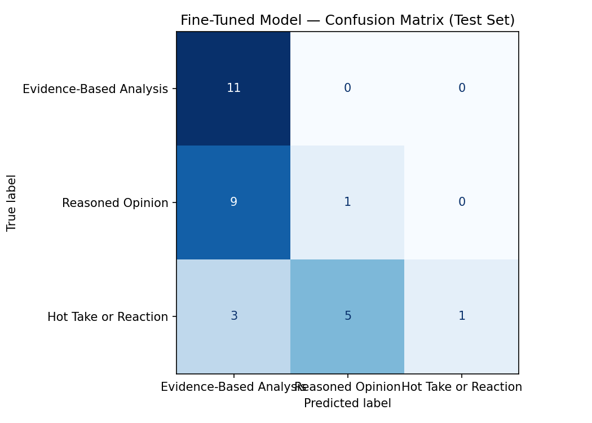

# ai201-project3-takemeter

# AI 201 Project 3 — LeBron Discussion Classifier

## Project Overview

This project fine-tunes `distilbert-base-uncased` to classify public Reddit posts and comments about LeBron James into three discourse categories: **Evidence-Based Analysis**, **Reasoned Opinion**, and **Hot Take or Reaction**. The goal is to test whether a small supervised text classifier can learn distinctions that basketball communities regularly make between supported analysis, explained opinion, and unsupported reaction.

The dataset contains 200 labeled examples collected from public LeBron-related discussions on `r/nba` and `r/NBATalk`. The notebook automatically splits the dataset into 70% training, 15% validation, and 15% test sets.

## Label Taxonomy

### Evidence-Based Analysis

A post or comment that supports its main claim with specific evidence, such as statistics, game performance, player measurements, salary information, roster construction, historical facts, or a concrete basketball comparison.

Example: “In 2009 he was listed at 6'9 and 250 pounds and still played about 39 minutes per game.”

### Reasoned Opinion

A post or comment that gives a clear opinion and an understandable explanation but does not rely heavily on statistics or specific verifiable evidence.

Example: “First-stint Cleveland LeBron was more entertaining because he attacked the rim without hesitation.”

### Hot Take or Reaction

A post or comment that is mainly emotional, exaggerated, insulting, celebratory, sarcastic, joking, or unsupported by meaningful reasoning.

Example: “LeBron is the GOAT and it is not even close.”

## Dataset

The final dataset contains 200 examples:

| Label | Count |
|---|---:|
| Evidence-Based Analysis | 70 |
| Reasoned Opinion | 65 |
| Hot Take or Reaction | 65 |
| **Total** | **200** |

Each row contains the post or comment text, one reviewed string label, a public source URL, and an optional notes field for difficult cases. No label accounts for more than 70% of the dataset.

## Annotation Process

The initial label definitions were created after reviewing LeBron discussions and identifying a recurring distinction between concrete basketball evidence, explained personal judgment, and emotional or unsupported reactions.

AI assistance was used to suggest preliminary labels and surface ambiguous cases. Every final label was reviewed against the written taxonomy. Borderline examples were documented in the notes column rather than accepted automatically.

The main annotation boundary was between **Evidence-Based Analysis** and **Reasoned Opinion**. A comment needed a concrete, checkable detail to qualify as analysis. A clear explanation without a concrete detail was labeled as reasoned opinion. A claim without meaningful evidence or explanation was labeled as a hot take or reaction.

## Model and Training

The fine-tuned model is `distilbert-base-uncased`.

Training used the starter Colab notebook with the default hyperparameters:

| Hyperparameter | Value |
|---|---:|
| Epochs | 3 |
| Learning rate | `2e-5` |
| Batch size | 16 |
| Train/validation/test split | 70% / 15% / 15% |

These settings were kept because the dataset is small and the default configuration provides a reasonable first experiment without excessive training.

## Zero-Shot Baseline

The baseline used Groq's `llama-3.3-70b-versatile` with a zero-shot classification prompt. The model received the three label definitions and was instructed to return only one exact label name.

### Baseline Results

| Metric | Score |
|---|---:|
| Accuracy | 0.400 |
| Macro F1 | 0.300 |
| Parseable responses | 30 / 30 |

### Baseline Per-Class Metrics

| Label | Precision | Recall | F1 | Support |
|---|---:|---:|---:|---:|
| Evidence-Based Analysis | 0.00 | 0.00 | 0.00 | 11 |
| Reasoned Opinion | 0.38 | 0.30 | 0.33 | 10 |
| Hot Take or Reaction | 0.41 | 1.00 | 0.58 | 9 |

The baseline overpredicted **Hot Take or Reaction**. It found all nine true hot-take examples, but it also assigned that label to many analysis and opinion examples. It failed to correctly identify any Evidence-Based Analysis examples.

## Fine-Tuned Model Results

The fine-tuned DistilBERT model achieved an accuracy of **0.4333** on the 30-example test set. This is an absolute improvement of **0.0333**, or 3.33 percentage points, over the zero-shot baseline.

| Metric | Baseline | Fine-Tuned |
|---|---:|---:|
| Accuracy | 0.4000 | 0.4333 |
| Absolute improvement | — | +0.0333 |

### Fine-Tuned Per-Class Metrics

| Label | Precision | Recall | F1 | Support |
|---|---:|---:|---:|---:|
| Evidence-Based Analysis | 0.478 | 1.000 | 0.647 | 11 |
| Reasoned Opinion | 0.167 | 0.100 | 0.125 | 10 |
| Hot Take or Reaction | 1.000 | 0.111 | 0.200 | 9 |

The fine-tuned model learned to recognize every true Evidence-Based Analysis example, but it predicted that label too often. It correctly identified only one Reasoned Opinion example and one Hot Take or Reaction example.

## Confusion Matrix

Rows are true labels and columns are predicted labels.

| True \ Predicted | Evidence-Based Analysis | Reasoned Opinion | Hot Take or Reaction |
|---|---:|---:|---:|
| Evidence-Based Analysis | 11 | 0 | 0 |
| Reasoned Opinion | 9 | 1 | 0 |
| Hot Take or Reaction | 3 | 5 | 1 |

The largest error pattern is **Reasoned Opinion → Evidence-Based Analysis**, with 9 of 10 reasoned opinions predicted as analysis. The second-largest pattern is **Hot Take or Reaction → Reasoned Opinion**, with 5 of 9 hot takes predicted as opinion.



## Error Pattern Analysis

The model appears to have learned a strong association between basketball-specific vocabulary and the Evidence-Based Analysis label. Comments that mention playing style, athletic traits, defense, roster construction, or historical comparisons may look analytical even when they only express an explained opinion.

The model also appears to treat longer or more grammatical reactions as Reasoned Opinion. A hot take can include a sentence of explanation while still being exaggerated or unsupported. The classifier often recognized the presence of reasoning but did not reliably judge whether the support was concrete enough.

These results suggest that the model captured surface-level cues such as length, basketball terminology, and explanatory structure more strongly than the intended evidence standard.

## Three Specific Misclassifications

The exported `evaluation_results.json` contains aggregate metrics but not the text of individual predictions. Replace the three rows below with examples printed by Section 4 of the Colab notebook.

| Post | True Label | Predicted Label | Analysis |
|---|---|---|---|
| `[Paste wrong prediction 1 from Colab]` | Reasoned Opinion | Evidence-Based Analysis | This likely contains basketball-specific reasoning but no concrete, checkable evidence. The model treated topical detail as evidence. |
| `[Paste wrong prediction 2 from Colab]` | Hot Take or Reaction | Reasoned Opinion | This likely includes a short explanation, but the claim remains exaggerated or unsupported. The model recognized structure but not evidentiary quality. |
| `[Paste wrong prediction 3 from Colab]` | Hot Take or Reaction | Evidence-Based Analysis | This likely mentions a specific basketball trait or comparison that triggered the analysis label even though the overall statement is mostly reaction. |

## Sample Classifications

Replace the rows below with 3–5 predictions and confidence scores from the notebook's sample-classification output.

| Post | Predicted Label | Confidence | Interpretation |
|---|---|---:|---|
| `[Paste sample post 1]` | `[label]` | `[score]` | `[Explain why this prediction is reasonable.]` |
| `[Paste sample post 2]` | `[label]` | `[score]` | |
| `[Paste sample post 3]` | `[label]` | `[score]` | |
| `[Optional sample post 4]` | `[label]` | `[score]` | |
| `[Optional sample post 5]` | `[label]` | `[score]` | |

## What the Model Learned vs. What I Intended

I intended the model to learn a hierarchy based on support:

1. Concrete, checkable support → Evidence-Based Analysis
2. An explanation without concrete support → Reasoned Opinion
3. No meaningful support, or mainly emotion and exaggeration → Hot Take or Reaction

Instead, the model appears to have learned a simpler pattern. Basketball terminology and detailed phrasing often triggered Evidence-Based Analysis, while explanatory sentence structure triggered Reasoned Opinion. It did not consistently determine whether a detail was actually evidence or whether an explanation was still exaggerated and unsupported.

The model therefore learned part of the intended distinction, but it overfit to surface form. The perfect recall for Evidence-Based Analysis and low precision show that it learned to find analysis-like language without learning a narrow boundary for that class.

## What I Would Change

The first improvement would be to add more difficult examples at the boundaries:

- Reasoned opinions that use basketball terminology but no concrete evidence
- Hot takes that contain a sentence of explanation
- Evidence-based comments where the evidence is subtle rather than numerical
- Short analysis comments with one verifiable fact
- Sarcastic comments whose literal wording sounds analytical

I would also tighten the annotation guide by requiring annotators to identify the exact evidence span before assigning Evidence-Based Analysis. If no specific span can be highlighted, the example should not receive that label.

A larger dataset would likely help because 140 training examples is small for a three-way subjective classification task.

## Definition of Success Review

The original success criteria were:

- At least 75% test accuracy
- At least 0.70 macro F1
- At least 0.65 F1 for every label
- Better performance than the zero-shot baseline

The model only met the final criterion, and only narrowly. It improved accuracy from 0.4000 to 0.4333, but it did not reach the accuracy or per-class F1 targets. Therefore, the current model is not ready for deployment as a real community classification tool.

## Spec Reflection

The project specification helped guide the implementation by requiring mutually exclusive labels and a per-class evaluation rather than accuracy alone. This requirement exposed a failure that accuracy by itself would hide: the fine-tuned model performed well on Evidence-Based Analysis recall but poorly on the other two labels.

The implementation diverged from the original plan because the zero-shot baseline and the fine-tuned model learned different biases. The baseline overpredicted Hot Take or Reaction, while the fine-tuned model overpredicted Evidence-Based Analysis. This showed that fine-tuning did not simply improve the baseline behavior; it created a different decision boundary shaped by the small labeled dataset.

## AI Usage

### Label Design and Stress Testing

I used ChatGPT to help refine the definitions for Evidence-Based Analysis, Reasoned Opinion, and Hot Take or Reaction. The tool generated possible boundary cases and suggested decision rules. I reviewed the suggestions and kept the rule that concrete, checkable support is required for Evidence-Based Analysis.

### Annotation Assistance

AI assistance was used to suggest preliminary labels and identify difficult examples in the collected Reddit comments. I reviewed the examples and retained final responsibility for the dataset. Ambiguous rows were marked with notes rather than accepted without review.

### Failure Analysis

I used ChatGPT to interpret the confusion matrix and identify systematic patterns. The initial pattern suggestion was that the model relied on basketball terminology and comment structure. I verified this interpretation against the direction of the errors in the confusion matrix before including it in the report.

## Repository Files

```text
ai201-project3-takemeter/
├── README.md
├── planning.md
├── labeled_dataset.csv
├── evaluation_results.json
├── confusion_matrix.png
└── requirements.txt
```

## How to Reproduce

1. Open the starter Colab notebook.
2. Set the runtime to a T4 GPU.
3. Define the three-label map.
4. Upload `labeled_dataset.csv`.
5. Run the dataset split and tokenization cells.
6. Run the Groq zero-shot baseline.
7. Fine-tune `distilbert-base-uncased`.
8. Evaluate the model on the locked test set.
9. Run the comparison and export cells.
10. Download `evaluation_results.json` and `confusion_matrix.png`.

## Demo Video Plan

The demo video should be 3–5 minutes and show:

1. The project goal and three labels
2. Three to five posts classified with predicted labels and confidence scores
3. One correct prediction with an explanation
4. One incorrect prediction with an explanation
5. Baseline versus fine-tuned accuracy
6. The confusion matrix and main error pattern
7. A brief reflection on what the model learned